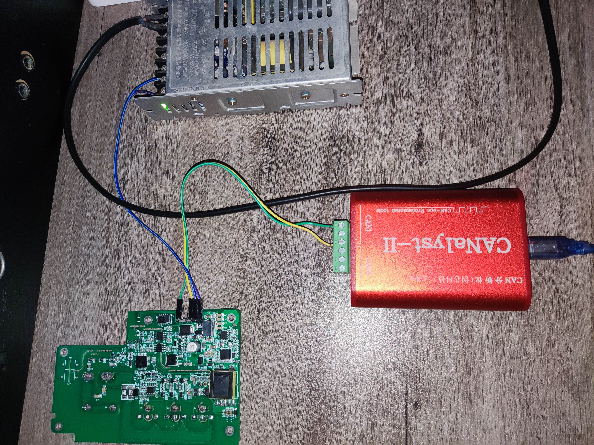
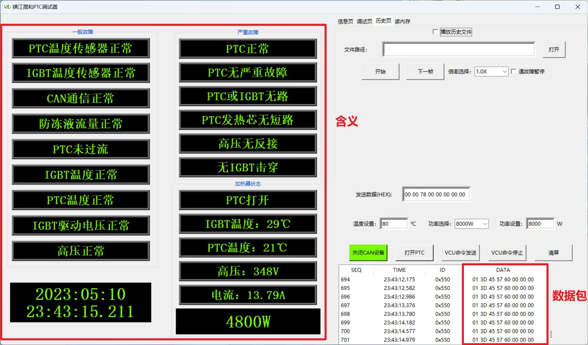
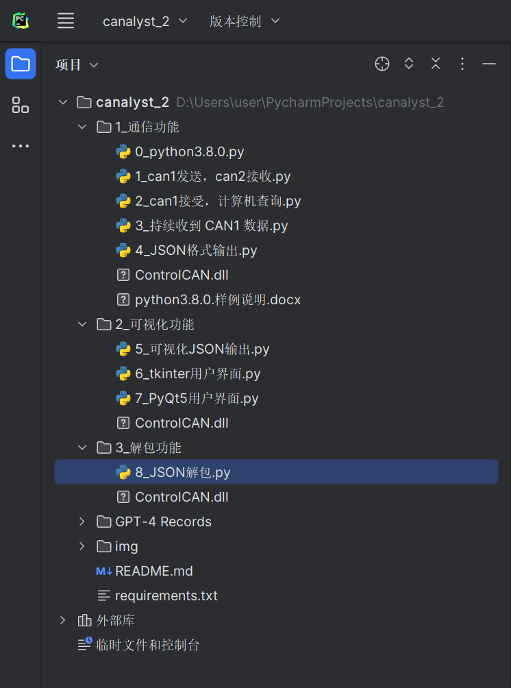
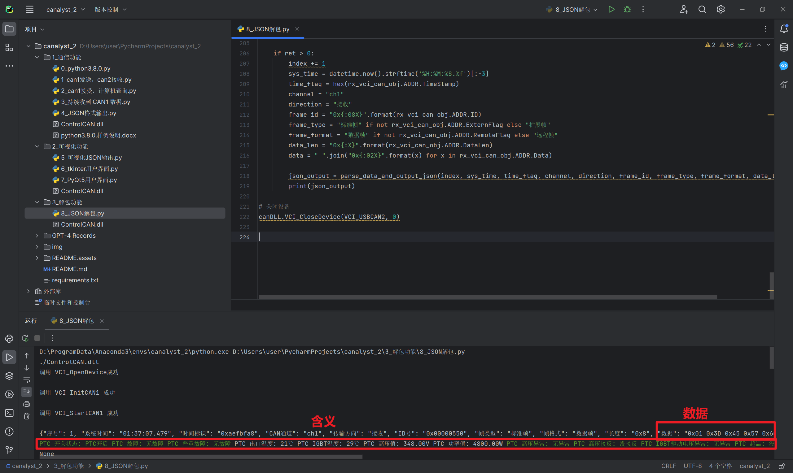

# 基于 CANalyst-Ⅱ 的 Python 解包程序

## 介绍

毕业设计《PTC 陶瓷加热控制器设计》中的软件部分。



这个是我毕设的一部分，左上角是一个供电，左下角是一个PCB，它的功能是通过 CAN 控制（PTC陶瓷加热控制系统）车载空调的工作功率，右侧是一个 CAN 分析仪可以接收 PCB 发出的数据，CAN 分析仪通过 USB 和计算机相连。

老师叫我写一个软件，可以读到 PCB 通过 CAN 发的包，并解析它的含义：



我分了 3 个对话（放在 `GPT-4 Records` 文件夹中，使用浏览器打开）和 GPT-4 交流，使用 8 个程序逐步迭代开发：



这是最终的效果：



只用了半天，200多行代码，我只是简单的调试了一些错误，就实现了这个毕设的小需求。

## 运行

```sh
git clone https://github.com/inuxtim0/canalyst_2.git
cd canalyst_2
```

2. 进入待测脚本文件夹（以最后一个为例）

``` sh
cd 3_解包功能
```


3. 安装依赖
```sh
# （选择I: 如熟悉python）（python版本3.8），备注：使用官方pip源或者阿里pip源,临时换源方法：python -m pip install -r requirements.txt -i https://mirrors.aliyun.com/pypi/simple/
python -m pip install -r requirements.txt

# （选择II: 如不熟悉python）使用anaconda，步骤也是类似的：
conda create -n canalyst_2 python=3.8    # 创建anaconda环境
conda activate canalyst_2                 # 激活anaconda环境
python -m pip install -r requirements.txt # 这个步骤和pip安装一样的步骤
```

4. 执行脚本

``` sh
python 8_JSON解包.py
```

## 闲谈

GPT 出来的时候，我就觉得“水平越高的人，能让 GPT 的能力越强”，所以我有些焦虑，因为作为学生，基础真的太差。最近我接触到了江科大的一些老师（因为我帮助了一些人，他们把我推荐给老师），我发现老师的理论能力都非常强，所以我觉得老师可以通过 GPT 实现更多学生实现不了的东西。

这里我推荐一个课程，是吴恩达老师的提示工程课程。

和 GPT 说话的方式，影响到它的回复质量，我能在半天内实现这个毕设阶段性的要求也有赖于之前积累的对提示工程的理解。提示工程就是教你如何与LLM对话，让它们提供更高质量的回复。

课程的链接如下：
<https://learn.deeplearning.ai/chatgpt-prompt-eng/>

------

